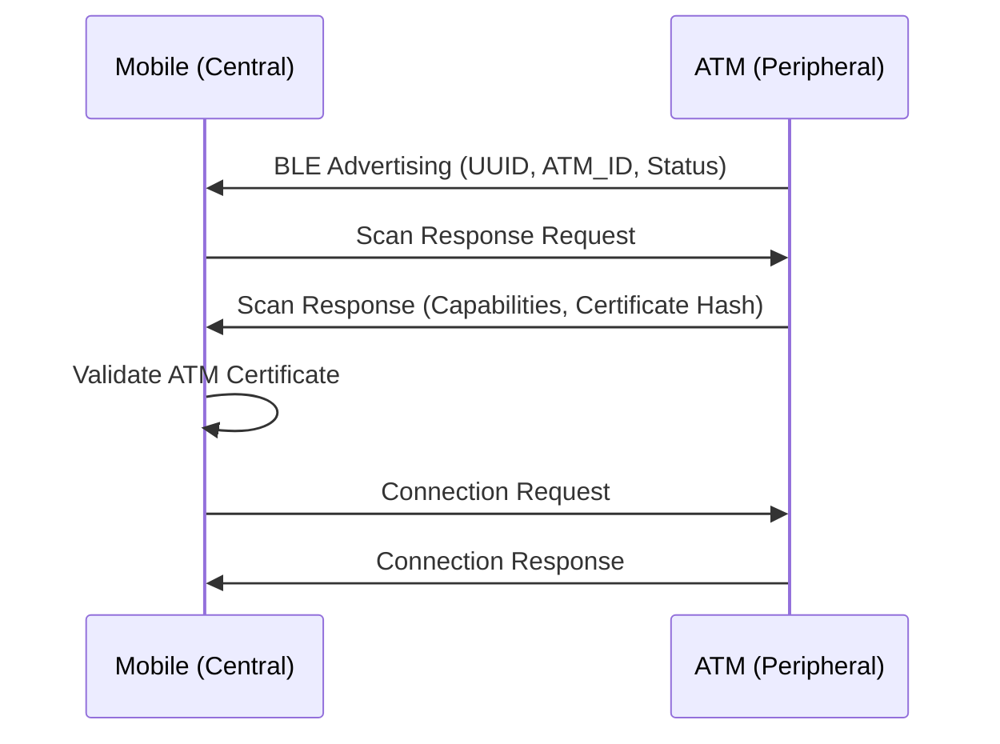
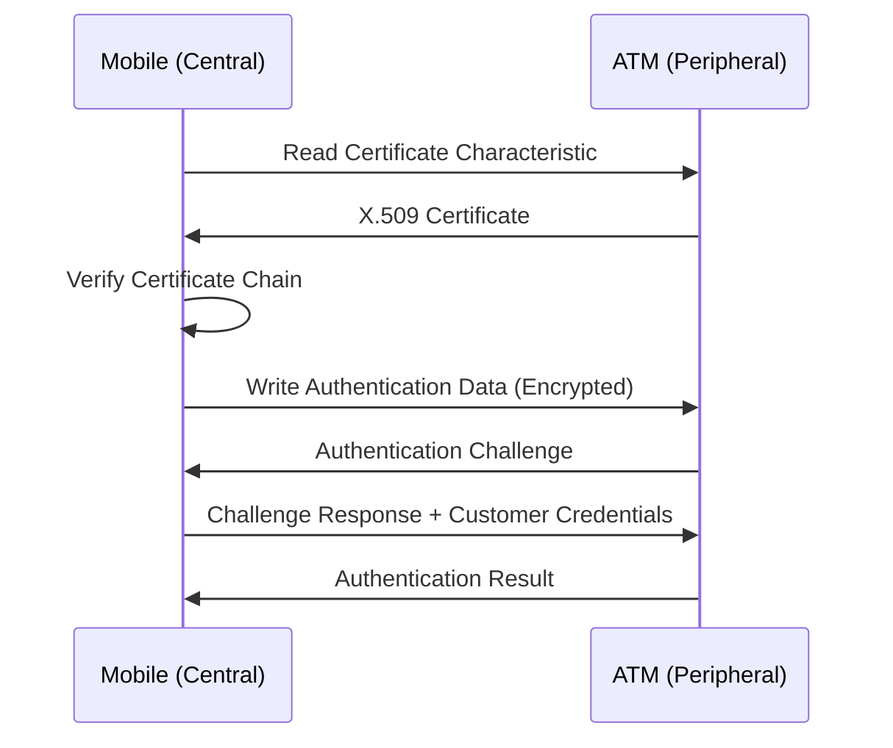
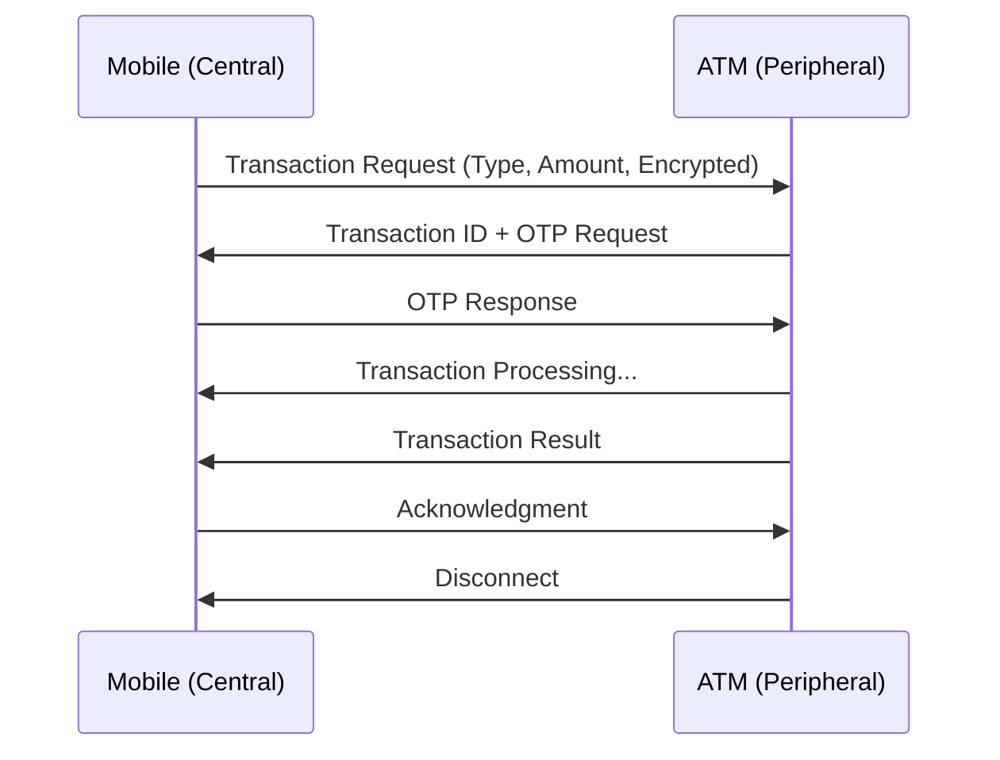

# ATMConnect Bluetooth Low Energy (BLE) Architecture

## Overview

This document defines the fundamental BLE architecture for ATMConnect, establishing the roles, responsibilities, and communication patterns between mobile devices and ATM machines.

## BLE Role Assignment

### ATM (Peripheral Role) 🏧

**Why ATM is Peripheral:**
- **Fixed Infrastructure**: ATMs are permanently installed and must be always available for connections
- **Multiple Sequential Users**: Can serve multiple customers one after another
- **24/7 Availability**: Must continuously advertise availability
- **Resource Optimization**: ATM hardware has limited BLE capabilities
- **Security Control**: Easier to validate and authorize incoming connections
- **Regulatory Compliance**: Banking regulations favor controlled access points

### Mobile Device (Central Role) 📱

**Why Mobile is Central:**
- **User-Initiated**: Customer decides when to interact with ATM
- **Dynamic Discovery**: Actively searches for nearby ATMs when needed
- **Superior BLE Stack**: Modern smartphones have advanced BLE capabilities
- **Session Control**: User controls connection lifecycle
- **Multi-ATM Support**: Can connect to different ATMs based on location
- **Better UX**: Natural scanning and selection interface

## Technical Architecture

### ATM (Peripheral) Implementation

```java
// BLE Advertising Configuration
BLEAdvertisingData advertisingData = BLEAdvertisingData.builder()
    .addServiceUUID("6E400001-B5A3-F393-E0A9-E50E24DCCA9E") // ATM Service UUID
    .setLocalName("ATM-" + atmCode)
    .setTxPowerLevel(-20)  // Short range for security (2-3 meters)
    .setAdvertisingInterval(1000)  // 1 second intervals
    .setConnectable(true)
    .build();

// GATT Services Structure
ATM_PRIMARY_SERVICE = "6E400001-B5A3-F393-E0A9-E50E24DCCA9E"
├── AUTHENTICATION_CHARACTERISTIC = "6E400002-B5A3-F393-E0A9-E50E24DCCA9E"
│   ├── Properties: READ, WRITE, NOTIFY
│   └── Descriptors: Client Characteristic Configuration
├── TRANSACTION_CHARACTERISTIC = "6E400003-B5A3-F393-E0A9-E50E24DCCA9E"
│   ├── Properties: WRITE, NOTIFY
│   └── Security: Encrypted, Authenticated
├── STATUS_CHARACTERISTIC = "6E400004-B5A3-F393-E0A9-E50E24DCCA9E"
│   ├── Properties: READ, NOTIFY
│   └── Values: AVAILABLE, BUSY, OUT_OF_SERVICE, CASH_LOW
└── CERTIFICATE_CHARACTERISTIC = "6E400005-B5A3-F393-E0A9-E50E24DCCA9E"
    ├── Properties: READ
    └── Contains: ATM's X.509 certificate for verification
```

#### ATM Advertising Data Structure

```java
// Manufacturer Specific Data (Optional)
ManufacturerData {
    CompanyID: 0x004C,  // Banking consortium ID
    Data: [
        ATM_TYPE: 0x01,     // Standard ATM
        CAPABILITIES: 0x0F,  // Cash + Balance + Transfer + PIN change
        STATUS: 0x01,       // Available
        CASH_LEVEL: 0x03    // High (0x01=Low, 0x02=Medium, 0x03=High)
    ]
}

// Service Data
ServiceData {
    ServiceUUID: "6E400001-B5A3-F393-E0A9-E50E24DCCA9E",
    Data: [ATM_ID_HASH, FIRMWARE_VERSION, SECURITY_LEVEL]
}
```

### Mobile Device (Central) Implementation

```java
// Scan Configuration
BLEScanSettings scanSettings = BLEScanSettings.builder()
    .setScanMode(ScanSettings.SCAN_MODE_BALANCED)
    .setCallbackType(ScanSettings.CALLBACK_TYPE_ALL_MATCHES)
    .setMatchMode(ScanSettings.MATCH_MODE_AGGRESSIVE)
    .setNumOfMatches(ScanSettings.MATCH_NUM_MAX_ADVERTISEMENT)
    .setReportDelay(0)
    .build();

// Scan Filters
BLEScanFilter atmFilter = BLEScanFilter.builder()
    .setServiceUuid(ParcelUuid.fromString("6E400001-B5A3-F393-E0A9-E50E24DCCA9E"))
    .setDeviceNamePrefix("ATM-")
    .build();

// Connection Parameters
ConnectionParameters connectionParams = ConnectionParameters.builder()
    .setConnectionInterval(24)      // 30ms intervals (24 * 1.25ms)
    .setSlaveLatency(0)            // No latency for banking operations
    .setSupervisionTimeout(200)     // 2 second timeout (200 * 10ms)
    .build();
```

## Communication Protocol

### 1. Discovery Phase



### 2. Authentication Phase



### 3. Transaction Phase



## Security Considerations

### Connection Security

```java
// ATM Security Requirements
public class ATMSecurityRequirements {
    
    // Connection must be encrypted and authenticated
    private static final int MIN_ENCRYPTION_KEY_SIZE = 128;  // AES-128 minimum
    private static final boolean REQUIRE_AUTHENTICATION = true;
    private static final boolean REQUIRE_AUTHORIZATION = true;
    
    // Certificate validation
    private static final String CERTIFICATE_ISSUER = "CN=BankingConsortium,O=ATMConnect";
    private static final int CERTIFICATE_VALIDITY_DAYS = 365;
    
    // Connection timeouts
    private static final int MAX_CONNECTION_TIME_SECONDS = 300;  // 5 minutes max
    private static final int IDLE_TIMEOUT_SECONDS = 60;         // 1 minute idle
}
```

### GATT Security Levels

```java
// Characteristic Security Configurations
AUTHENTICATION_CHARACTERISTIC {
    Security: ENCRYPT | AUTHENTICATE,
    Permissions: READ | WRITE,
    Protection: MITM_PROTECTION_REQUIRED
}

TRANSACTION_CHARACTERISTIC {
    Security: ENCRYPT | AUTHENTICATE | AUTHORIZE,
    Permissions: WRITE | NOTIFY,
    Protection: LESC_PAIRING_REQUIRED  // LE Secure Connections
}

STATUS_CHARACTERISTIC {
    Security: NONE,  // Public information
    Permissions: READ | NOTIFY,
    Protection: NONE
}
```

## Range and Power Management

### Signal Strength Configuration

```java
// ATM Advertising Power
TX_POWER_LEVEL = -20 dBm;  // ~2-3 meter range for security
ADVERTISING_INTERVAL = 1000ms;  // Balance between discoverability and power

// Mobile Scanning Power
SCAN_WINDOW = 100ms;       // Active scanning window
SCAN_INTERVAL = 1000ms;    // Scan every second
MAX_SCAN_DURATION = 30s;   // Auto-stop after 30 seconds
```

### Range Considerations

- **Optimal Range**: 2-3 meters (for user privacy and security)
- **Maximum Range**: 5 meters (to prevent accidental connections)
- **Minimum RSSI**: -70 dBm (ensure stable connection)

## Error Handling and Recovery

### Connection Failures

```java
public enum BLEErrorRecovery {
    CONNECTION_TIMEOUT {
        @Override
        public void handle() {
            // Retry connection with exponential backoff
            retryConnection(currentRetryCount * 2);
        }
    },
    
    AUTHENTICATION_FAILURE {
        @Override
        public void handle() {
            // Disconnect immediately, log security event
            disconnectSecurely();
            logSecurityEvent("BLE_AUTH_FAILURE");
        }
    },
    
    TRANSACTION_INTERRUPTED {
        @Override
        public void handle() {
            // Save transaction state, attempt recovery
            saveTransactionState();
            attemptTransactionRecovery();
        }
    },
    
    CERTIFICATE_INVALID {
        @Override
        public void handle() {
            // Block ATM, notify security team
            blockATMConnection();
            notifySecurityTeam("INVALID_CERTIFICATE");
        }
    }
}
```

## Implementation Classes

### ATM Side (Peripheral)

```java
// Core peripheral implementation
@Component
public class ATMBLEPeripheral {
    
    @Autowired
    private CertificateService certificateService;
    
    @Autowired
    private TransactionService transactionService;
    
    @PostConstruct
    public void startAdvertising() {
        // Initialize GATT server
        // Start advertising
        // Setup characteristic handlers
    }
    
    public void handleConnectionRequest(BLEDevice device) {
        // Validate device
        // Establish secure connection
        // Begin authentication
    }
}
```

### Mobile Side (Central)

```java
// Core central implementation
@Service
public class MobileBLECentral {
    
    @Autowired
    private ATMDiscoveryService atmDiscoveryService;
    
    @Autowired
    private SecurityService securityService;
    
    public CompletableFuture<List<ATMDevice>> scanForATMs() {
        // Configure scan filters
        // Start scanning
        // Validate discovered ATMs
        // Return verified ATM list
    }
    
    public CompletableFuture<BLEConnection> connectToATM(ATMDevice atm) {
        // Establish connection
        // Verify certificate
        // Setup secure channel
    }
}
```

## Configuration Constants

```java
public final class BLEConstants {
    
    // UUIDs
    public static final String ATM_SERVICE_UUID = "6E400001-B5A3-F393-E0A9-E50E24DCCA9E";
    public static final String AUTH_CHARACTERISTIC_UUID = "6E400002-B5A3-F393-E0A9-E50E24DCCA9E";
    public static final String TRANSACTION_CHARACTERISTIC_UUID = "6E400003-B5A3-F393-E0A9-E50E24DCCA9E";
    public static final String STATUS_CHARACTERISTIC_UUID = "6E400004-B5A3-F393-E0A9-E50E24DCCA9E";
    public static final String CERTIFICATE_CHARACTERISTIC_UUID = "6E400005-B5A3-F393-E0A9-E50E24DCCA9E";
    
    // Timing
    public static final int ADVERTISING_INTERVAL_MS = 1000;
    public static final int CONNECTION_TIMEOUT_MS = 10000;
    public static final int TRANSACTION_TIMEOUT_MS = 300000;  // 5 minutes
    public static final int IDLE_TIMEOUT_MS = 60000;         // 1 minute
    
    // Security
    public static final int MIN_ENCRYPTION_KEY_SIZE = 128;
    public static final int MAX_CONNECTION_TIME_MS = 300000;
    public static final int MIN_RSSI = -70;
    public static final int MAX_RANGE_METERS = 5;
    
    // Error codes
    public static final int ERROR_CONNECTION_FAILED = 0x01;
    public static final int ERROR_AUTHENTICATION_FAILED = 0x02;
    public static final int ERROR_CERTIFICATE_INVALID = 0x03;
    public static final int ERROR_TRANSACTION_TIMEOUT = 0x04;
}
```

## Testing Strategy

### Unit Tests
- ATM advertising functionality
- Mobile scanning and filtering
- Certificate validation
- Security characteristic handling

### Integration Tests
- Full connection lifecycle
- Authentication flow
- Transaction processing
- Error recovery scenarios

### Security Tests
- Man-in-the-middle prevention
- Certificate validation bypass attempts
- Range and signal strength validation
- Encryption key strength verification

---

**Document Version**: 1.0  
**Last Updated**: December 2024  
**Review Required**: Before any BLE implementation begins  
**Approval Required**: Security Team, Architecture Team